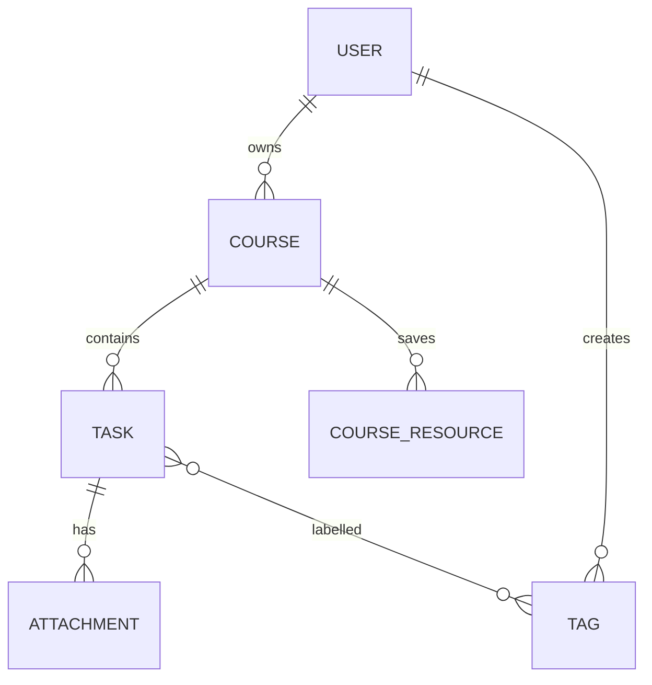

# Study Planner Blueprint

## Purpose

This app helps university students organise courses, study tasks, learning resources, and study progress in one place.

## Main user journey

1. Register or log in.
2. Create a course.
3. Create a study task for that course.
4. Add tags and an attachment to the task.
5. Search and filter the paginated task list.
6. Update a task status without a full page reload.
7. Search Open Library and save a useful book to the course.

## Data model

Ownership of a task is derived through its course. A task belongs to the logged-in user only when `task.course.user_id` matches that user's ID.

## Planned application routes

| Method | URI | Purpose |
| --- | --- | --- |
| GET | `/dashboard` | Show the student's overview |
| GET | `/courses` | List the student's courses |
| GET, POST | `/courses/create` | Show and submit the course form |
| GET | `/courses/{course}` | Show a course and its resources |
| GET, POST | `/tasks/create` | Show and submit the task form |
| GET | `/tasks` | Search, filter, and paginate tasks |
| GET, PUT | `/tasks/{task}/edit` | Show and submit task changes |
| DELETE | `/tasks/{task}` | Delete an owned task |
| POST | `/tasks/{task}/attachments` | Upload a task attachment |
| GET | `/tasks/{task}/attachments/{attachment}` | Download an owned attachment |
| GET, POST | `/courses/{course}/resources` | Search and save Open Library books |
| GET | `/admin` | Show the role-protected admin area |

Exact Livewire route definitions will be added with the UI milestones.
